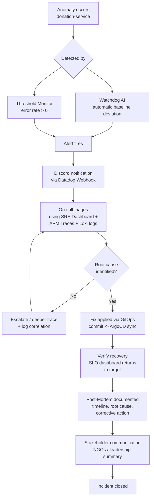

# ITSM / AIOps — Gestão Preditiva de Incidentes
## SolidaryTech — donation-service

---

## 1. AIOps: Datadog Watchdog

Watchdog is Datadog's embedded AI engine and requires no manual
enablement — it runs continuously across any service reporting APM
data, analyzing **error rate, latency, and request volume (hits)**
against learned historical baselines, and surfaces deviations as
Watchdog Insights without any monitor being explicitly configured for
them.

Because `donation-service` already reports these three signals via
OpenTelemetry → OTel Collector → Datadog (see Observability/APM
section), Watchdog has been analyzing this service since traces began
flowing — no separate setup step was required to satisfy this rubric
item; the deliverable is demonstrating it, not configuring it.

**Evidence for the report/video:** APM → Watchdog Insights, and the
"Investigate" anomaly-detection overlay available directly on the SRE
Dashboard's timeseries widgets (Request Rate, Error Rate, Latency).

---

## 2. Incident Response Automation

A Datadog Monitor watches `donation-service`'s error-rate metric and
notifies a Discord channel via webhook the moment a threshold is
breached — the simplest possible automated response path, requiring no
custom code or additional infrastructure.

**Monitor:** `sum(last_5m):sum:trace.http.server.request.errors{service:donation-service}.as_count() > 0`

**Notification target:** Discord webhook (`@webhook-discord-incidents`),
configured via Datadog's native Webhooks integration. Gmail (`@email`)
is available as a zero-setup fallback channel.

This closes the loop from *detection* (Watchdog/Monitor) to *human
notification* (Discord) without a human needing to be actively
watching a dashboard for the failure to be noticed.

---

## 3. Incident Lifecycle

**Stages explained:**

1. **Detection** — dual path: Watchdog's unsupervised anomaly
   detection catches deviations no static threshold was written for;
   an explicit Monitor catches the specific, known failure mode (error
   rate on the Hot Path) with a guaranteed, low-latency trigger.
2. **Alert** — routed to Discord in real time, so the response clock
   starts the moment the platform notices, not the moment a human
   happens to check a dashboard.
3. **Triage** — the SRE Dashboard, APM traces, and Loki logs (already
   deployed) are the tools used to move from "something is wrong" to
   "this specific component is wrong," mirroring the actual diagnostic
   pattern used throughout this project's own build-out (see the MTTR
   section of the SRE report for five real, worked examples of exactly
   this loop).
4. **Resolution** — because the platform is GitOps-managed, the fix is
   always a Git commit, never a manual cluster mutation — this is what
   makes the resolution auditable and prevents the same class of
   "silent manual fix that gets reverted later" incident this project
   encountered several times during initial setup.
5. **Verification** — the same SLO dashboard used to detect the
   problem confirms the fix, closing the loop with the same
   instrumentation on both ends.
6. **Post-Mortem & stakeholder communication** — a short, blameless
   write-up (timeline, root cause, fix, prevention) shared with
   NGO-facing stakeholders, appropriate to a platform whose downtime
   directly affects real donation flow.
